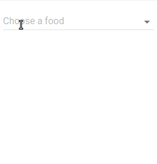

# material-ui-enhanced-fields

A collection of enhanced fields for use with [material-ui](material-ui) (v1 beta).

- A [ComboboxField](#ComboboxField).



See [storybook][storybook] for live demos.

## Install
```
yarn add material-ui-enhanced-fields@next
```
```
npm i material-ui-enhanced-fields@next
```

## Components
- [ComboboxField](#ComboboxField)

### ComboboxField
A customisable 'combobox' field that allows both text input and selection from a drop-down menu.
With `multiple` set to `false` (default) the selected value is displayed as text in the `<input/>` element.
With `multiple` set to `true` selectedItems are stored in a prefix. The default rendering is `Chip`'s.
Items can be grouped into sublist by supplying the a `groupField` prop (default is 'group').
Based on the [Downshift](Downshift) library.

#### Basic Examples
```jsx
const DATA = ['apples', 'oranges'];

<ComboboxField
  items={DATA}
  TextFieldProps={{ floatingLabelText: 'Pick a food' }}
/>
```

```jsx
const DATA = [{text: 'apple', type: 'fruit'}, {text: 'tomato', type: 'veg'}];
<ComboboxField
  items={DATA}
  itemToString={item => item === null ? '' : item.text}
  groupField={'type'}
  TextFieldProps={{ floatingLabelText: 'Pick a food' }}
/>
```

#### Props
prop | type | default | description
--- | --- | --- | ---
`classes` | `Object` || Override the CSS classes (see implementation).
`className` | 'string' || CSS class for the root element.
`filterFunc` | `function(items: Array, query: string)` | |  Override the default function for filtering the items based on the field's input value.
`items` | `Array` | `[]` | The array of possible items to select.
`groupField` | `string` | `'group'` | The name of the key to group each item object by. (Optional, if items aren't objects or don't have a field to group by, they won't be grouped.)
`menuBottomElement` | `Object` || An element to display at the bottom of the menu.
`menuBottomFixed` | `boolean` | `true` | Fix the `menuBottom` element so it's reachable without scrolling.
`MenuProps` | `Object` || Props to be merged into the `Menu` component.
`multiple` | `boolean` | `false` | Allow multiple selected items.
`noMatchProps` | `Object` || Props to be merged to the component displayed when there are no matched items.
`noMatchText` | `node` || Text to be displayed if there are no matched items to display in the menu.
`renderMenuItem` | `function({downShiftProps: {}, index: number, item: any, key: string, selectedItems: Array})` || Override the default rendering of each menu item. Should return an element that employ's the Downshift getItemProps 'prop getter' function.  See source code and [Downshift](Downshift).
`renderSelectedItem` | `function({deselect: function, hasFocus: boolean, item: any, itemToString: function})` || Override the default rendering (uses `Chip`s) of each selected item. (Only applies when the `multiple` is `true`.)   `deselect`: A callback that will deselect the item. `hasFocus`: True if item has been focused with keyboard.  `item`: The item to render.  `itemToString`: The `itemToString` prop supplied for convenience.
`SubheaderProps` | `Object` || Props to be merged ino each `Subheader`.
`TextFieldProps` | `Object` || Props for the `TextField` component.
> In addtion, you can pass all the props of the `Downshift` component, except the `inputValue`. [See here.](Downshift)

[storybook]: https://jf248.github.io/material-ui-enhanced-fields/
[Downshift]: https://github.com/paypal/downshift
[Downshift-RenderPropFunction]: https://github.com/paypal/downshift#render-prop-function
[material-ui]: https://github.com/mui-org/material-ui
